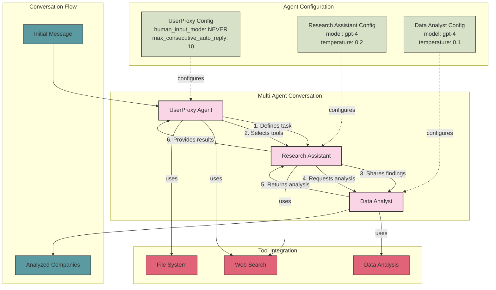

# AutoGen Architecture

## Overview

AutoGen is a framework that enables the development of LLM applications using multiple agents that can converse with each other to solve tasks. It focuses on multi-agent conversations with tool use and customizable agent behaviors.

## Architecture Diagram

## Key Components

### 1. Agents
AutoGen uses multiple specialized agents that converse with each other:

- **UserProxy Agent**:
  - Type: user_proxy
  - Human Input Mode: NEVER (automated)
  - Max Consecutive Auto Reply: 10
  - Tools: web_search, file_system
  - Role: Defines tasks and selects appropriate tools

- **Research Assistant Agent**:
  - Type: assistant
  - LLM Config: gpt-4, temperature 0.2
  - System Message: Fintech industry research expert
  - Role: Discovers emerging fintech companies from public sources
  
#### Source Prioritization
The Research Assistant agent prioritizes credible financial sources based on the configuration in `datasources.json`:
1. **Yahoo Finance** (highest priority): Comprehensive financial news and data
2. **Business Insider**: Business and financial news with market analysis
3. **Bloomberg**: Global business and financial information
4. **CNBC**: Business and financial market news
5. **Financial Times**: International business and financial news

Sources are weighted by credibility and relevance, with financial sources receiving higher priority.

- **Data Analyst Agent**:
  - Type: assistant
  - LLM Config: gpt-4, temperature 0.1
  - System Message: Data analyst specializing in fintech companies
  - Role: Extracts and structures information about companies

### 2. Conversation
The central organizing structure in AutoGen. A conversation consists of:
- Multiple agents
- Initial message to start the conversation
- Maximum number of turns (15)

### 3. Workflow
The conversation follows a structured flow:

1. UserProxy defines the research task
2. UserProxy selects appropriate tools for research
3. Research Assistant searches for companies across financial databases and news sources
4. Research Assistant verifies the credibility of sources
5. Data Analyst extracts structured data from verified sources
6. Data Analyst analyzes market position and strategic relevance
7. Data Analyst calculates weighted scores for companies

### 4. Tools
Agents can use various tools to accomplish their tasks:
- Web search
- File system
- Data analysis

## Strengths

- Multi-agent conversations
- Tool use and function calling
- Customizable agent behaviors
- Human-in-the-loop interactions (when needed)
- Code generation and execution capabilities

## Limitations

- Requires OpenAI API key
- Complex setup for advanced scenarios
- Limited built-in data processing capabilities

## References

- AutoGen documentation: https://microsoft.github.io/autogen/
