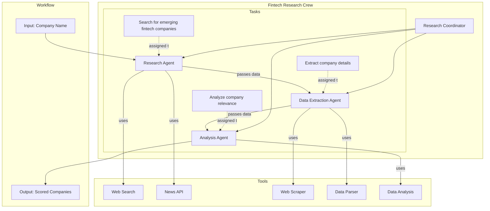

# CrewAI Architecture

## Overview

CrewAI is a framework for orchestrating role-playing autonomous AI agents. It uses a crew-based approach with specialized agents that have specific roles and goals. The framework enables multi-agent collaboration with sequential and parallel task execution.

## Architecture Diagram

## Key Components

### 1. Crew
The central organizing structure in CrewAI. A crew consists of multiple agents with different roles and a set of tasks to be executed.

### 2. Agents
Specialized AI agents with defined roles, goals, and tools:
- **Research Agent**: Discovers companies from credible public sources with prioritization of financial sources
- **Data Extraction Agent**: Extracts structured data about companies
- **Analysis Agent**: Analyzes company data and determines relevance

#### Source Prioritization
The Research Agent prioritizes credible financial sources based on the configuration in `datasources.json`:
1. **Yahoo Finance** (highest priority): Comprehensive financial news and data
2. **Business Insider**: Business and financial news with market analysis
3. **Bloomberg**: Global business and financial information
4. **Financial Times**: International business and financial news
5. **CNBC**: Business and financial market news

Sources are weighted by credibility and relevance, with financial sources receiving higher priority.

### 3. Tasks
Defined work items assigned to specific agents:
- Search for emerging fintech companies
- Extract company details
- Analyze company relevance

### 4. Tools
Capabilities that agents can use to accomplish their tasks:
- Web search
- News API
- Web scraper
- Data parser
- Data analysis

## Workflow

1. The Research Agent searches for emerging fintech companies using web search and news API tools
2. The Data Extraction Agent extracts structured data from the research results
3. The Analysis Agent analyzes the extracted data and scores companies based on relevance

## Strengths

- Multi-agent collaboration with specialized roles
- Sequential and parallel task execution
- Memory and context sharing between agents
- Role-based agent specialization

## Limitations

- Requires OpenAI API key
- Limited to text-based data sources

## References

- CrewAI documentation: https://docs.crewai.com/
