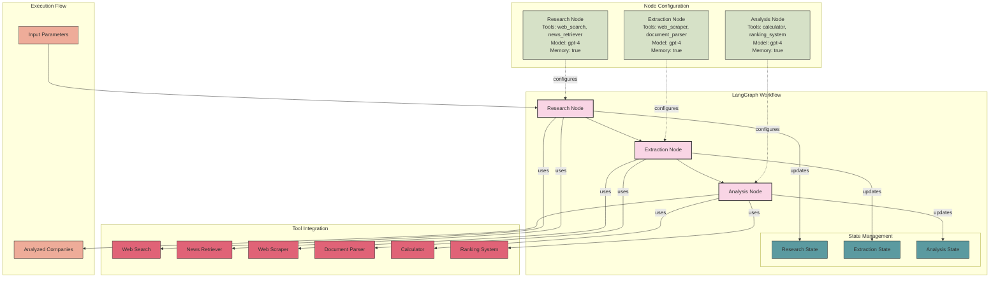

# LangGraph/LangChain Architecture

## Overview

LangGraph is an extension of LangChain that provides a state graph abstraction for creating stateful, multi-actor applications with LLMs. It focuses on composable agent workflows with state management and cyclical execution flows.

## Architecture Diagram

## Key Components

### 1. Nodes
LangGraph uses specialized nodes that perform specific functions in the workflow:

- **Research Node**:
  - Description: Research emerging fintech companies
  - Tools: web_search, news_retriever
  - Model: gpt-4
  - Memory: enabled
  - Function: Searches for and collects data about fintech companies

- **Extraction Node**:
  - Description: Extract structured data from research results
  - Tools: web_scraper, document_parser
  - Model: gpt-4
  - Memory: enabled
  - Function: Extracts and validates structured information from collected data

- **Analysis Node**:
  - Description: Analyze and score companies based on criteria
  - Tools: calculator, ranking_system
  - Model: gpt-4
  - Memory: enabled
  - Function: Analyzes market position, evaluates strategic relevance, and calculates scores

### 2. Graph
The central organizing structure in LangGraph. A graph consists of:
- Nodes that perform specific functions
- Edges that define the flow between nodes
- An entry point (Research Node)

### 3. State Management
LangGraph provides state management capabilities:
- Each node can update and access state
- State persists throughout the execution flow
- Enables complex, stateful applications

### 4. Workflow
The graph execution follows a directed flow:

1. Research Node searches for fintech companies and collects data
2. Extraction Node extracts structured information from the research results
3. Analysis Node analyzes the extracted data and calculates scores

### 5. Tools
Nodes can use various tools to accomplish their tasks:
- Web search
- News retriever
- Web scraper
- Document parser
- Calculator
- Ranking system

## Strengths

- Composable agent workflows
- State management and persistence
- Cyclical and conditional execution flows
- Extensive tool integration
- Document processing and retrieval

## Limitations

- Requires OpenAI API key
- Complex graph definition for advanced workflows
- Steeper learning curve than some frameworks

## References

- LangGraph documentation: https://python.langchain.com/docs/langgraph
- LangChain documentation: https://python.langchain.com/docs/get_started
