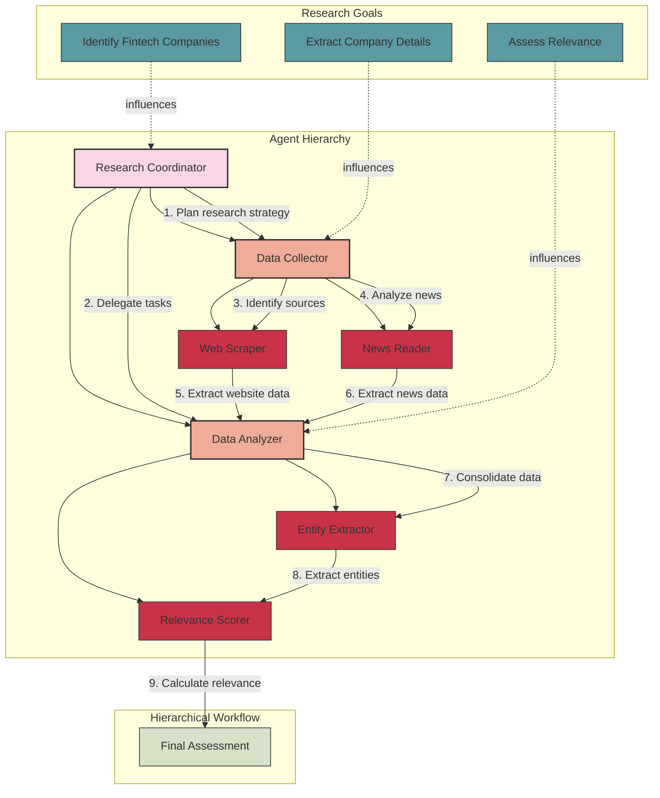

# LettaAI Architecture

## Overview

LettaAI is a framework that implements a hierarchical agent organization with goal-oriented task planning. It uses a structured hierarchy of specialized agents with clear subordinate relationships to accomplish complex research tasks.

## Architecture Diagram

## Key Components

### 1. Agent Hierarchy
LettaAI organizes agents in a hierarchical structure with clear reporting lines:

- **Research Coordinator**: Top-level agent that plans and coordinates the research process
  - **Data Collector**: Mid-level agent responsible for data collection from credible sources
    - **Web Scraper**: Extracts data from websites
    - **News Reader**: Extracts information from news articles
  - **Data Analyzer**: Mid-level agent responsible for data analysis
    - **Entity Extractor**: Identifies and extracts key entities
    - **Relevance Scorer**: Scores entities based on relevance criteria

#### Source Prioritization
The Data Collector agent prioritizes credible financial sources based on the configuration in `datasources.json`:
1. **Yahoo Finance** (highest priority): Comprehensive financial news and data
2. **Business Insider**: Business and financial news with market analysis
3. **Bloomberg**: Global business and financial information
4. **CNBC**: Business and financial market news
5. **Financial Times**: International business and financial news

Sources are weighted by credibility and relevance, with financial sources receiving higher priority.

### 2. Goals
LettaAI uses goal-oriented task planning with specific criteria:

- **Identify Fintech Companies**: Find emerging fintech companies from public sources
  - Criteria: Minimum number of companies, founding year threshold
- **Extract Company Details**: Extract key attributes for each company
  - Criteria: Required attributes (name, founding year, location, etc.)
- **Assess Relevance**: Evaluate relevance to financial sector
  - Criteria: Minimum relevance score threshold

### 3. Workflow
The hierarchical workflow follows a top-down approach:

1. Research Coordinator plans the research strategy
2. Research Coordinator delegates tasks to Data Collector and Data Analyzer
3. Data Collector identifies reliable sources
4. Web Scraper extracts data from websites
5. News Reader analyzes news articles
6. Data Analyzer consolidates collected information
7. Entity Extractor identifies key entities
8. Relevance Scorer calculates strategic relevance
9. Final assessment is generated

## Strengths

- Hierarchical agent organization with clear roles and responsibilities
- Goal-oriented task planning with specific criteria
- Adaptive information retrieval
- Continuous learning from feedback

## Limitations

- Higher computational requirements
- Complex setup process

## References

- LettaAI documentation (hypothetical framework)
