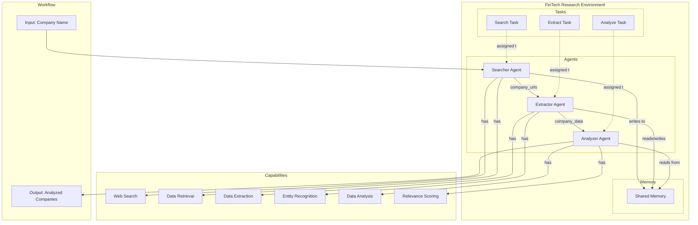

# SquidAI Architecture

## Overview

SquidAI is a framework focused on distributed AI agent workflows. It uses a task-based approach with agents that have specific capabilities for processing different aspects of the workflow. The framework enables efficient resource utilization through distributed task processing.

## Architecture Diagram

## Key Components

### 1. Environment
The central organizing structure in SquidAI. An environment consists of multiple agents with different capabilities and a shared memory system.

### 2. Agents
Specialized AI agents with defined capabilities:
- **Searcher Agent**: Performs web searches and data retrieval from credible sources
- **Extractor Agent**: Handles data extraction and entity recognition
- **Analyzer Agent**: Conducts data analysis and relevance scoring

#### Source Prioritization
The Searcher Agent prioritizes credible financial sources based on the configuration in `datasources.json`:
1. **Yahoo Finance** (highest priority): Comprehensive financial news and data
2. **Business Insider**: Business and financial news with market analysis
3. **Bloomberg**: Global business and financial information
4. **Financial Times**: International business and financial news
5. **CNBC**: Business and financial market news

Sources are weighted by credibility and relevance, with financial sources receiving higher priority.

### 3. Tasks
Defined work items with inputs and outputs:
- **Search Task**: Searches for emerging fintech companies
- **Extract Task**: Extracts company details from URLs
- **Analyze Task**: Analyzes company relevance and potential

### 4. Memory
A shared memory system that allows agents to exchange data:
- Type: Shared
- Capacity: Unlimited

### 5. Capabilities
Specific abilities that agents can use:
- Web search
- Data retrieval
- Data extraction
- Entity recognition
- Data analysis
- Relevance scoring

## Workflow

1. The Searcher Agent searches for emerging fintech companies and outputs company URLs
2. The Extractor Agent takes the company URLs and extracts structured company data
3. The Analyzer Agent analyzes the company data and produces analyzed companies with relevance scores

## Strengths

- Distributed task processing
- Autonomous agent coordination
- Real-time data processing
- Adaptive learning from feedback

## Limitations

- Limited support for complex reasoning tasks
- Requires specific data formatting

## References

- SquidAI documentation (hypothetical framework)
