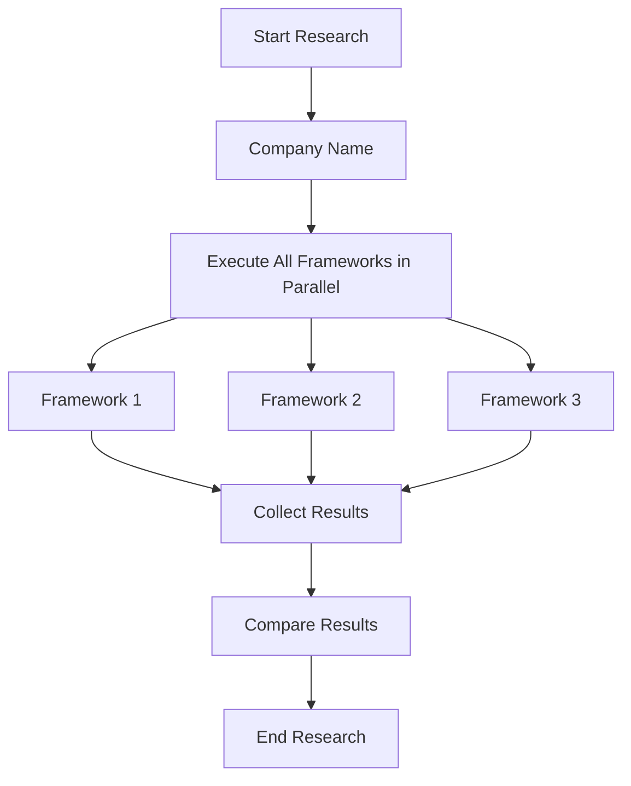
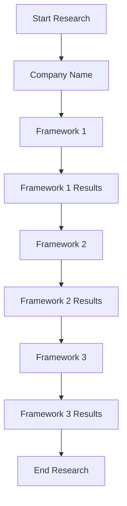
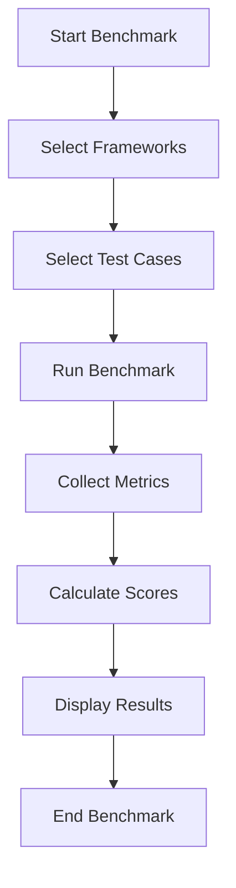

# Research Flow Documentation

This document describes the research flow in the Market Research AI Agent Testing Platform.

## Overview

The platform supports multiple research flows to evaluate different AI agent frameworks:

1. **Parallel Research**: Run multiple frameworks simultaneously on the same company
2. **Sequential Research**: Run frameworks in sequence, passing data between them
3. **Benchmark**: Evaluate frameworks against standard test cases

## Research Orchestrator

The Research Orchestrator manages the execution of research jobs across multiple frameworks. It provides two main execution modes:

### Parallel Research

In parallel research mode, all selected frameworks run independently on the same company. This allows for direct comparison of results and performance.



### Sequential Research

In sequential research mode, frameworks run in a specified order, with each framework receiving data from the previous one. This allows for evaluating how frameworks can build upon each other's results.



## Benchmarking

The benchmarking system evaluates frameworks against standard test cases. It measures:

1. **Execution Time**: How long each framework takes to complete research
2. **Success Rate**: Percentage of test cases successfully completed
3. **Data Completeness**: How complete the extracted company data is
4. **Source Credibility**: Quality of sources used for research



## Framework Adapters

Each framework adapter implements a common interface defined in `baseAdapter.js`. The adapters are responsible for:

1. Creating agents specific to the framework
2. Defining the workflow for the framework
3. Generating framework-specific reasoning steps
4. Executing the real implementation or falling back to mock data

### Adapter Structure

All framework adapters follow a similar structure:

```javascript
// Example adapter structure
const baseAdapter = require('./baseAdapter');
const realImplementation = require('./realImplementation');

class FrameworkAdapter extends baseAdapter {
  constructor() {
    super('FrameworkName');
  }
  
  async researchCompany(companyName, options = {}) {
    // Framework-specific implementation
  }
  
  async createAgents() {
    // Create framework-specific agents
  }
  
  async executeWorkflow(companyName) {
    // Define and execute the workflow
  }
}
```

### Credible Sources

All framework adapters are configured to prioritize credible financial sources:

1. Yahoo Finance
2. Bloomberg
3. Financial Times
4. CNBC
5. Reuters
6. Wall Street Journal
7. Business Insider
8. TechCrunch

## API Endpoints

### Research API

- `POST /api/research/parallel`: Execute parallel research
  - Parameters:
    - `companyName`: Name of the company to research
    - `frameworks`: Array of framework names to use
    - `options`: Additional options for research

- `POST /api/research/sequential`: Execute sequential research
  - Parameters:
    - `companyName`: Name of the company to research
    - `frameworks`: Array of framework names in execution order
    - `options`: Additional options for research

- `POST /api/research/benchmark`: Run benchmark on frameworks
  - Parameters:
    - `frameworks`: Array of framework names to benchmark
    - `testCases`: Optional array of test cases to use

- `GET /api/research/benchmark/testcases`: Get benchmark test cases

### Framework API

- `GET /api/frameworks`: Get all available frameworks
- `GET /api/frameworks/:name`: Get framework details
- `GET /api/frameworks/:name/performance`: Get framework performance metrics
- `POST /api/frameworks/compare`: Compare frameworks

## User Interface

The platform provides three main research interfaces:

1. **Company Research**: Standard parallel research on a specific company
   - Input company name
   - Select frameworks to use
   - View results in a comparison dashboard

2. **Sequential Research**: Research with data passing between frameworks
   - Input company name
   - Select and order frameworks
   - View sequential execution results

3. **Benchmark**: Evaluate frameworks against standard test cases
   - Select frameworks to benchmark
   - Choose test cases
   - View performance metrics and scores

Each interface provides detailed visualization of the research process and results, including:

- Framework execution steps
- Research logs
- JSON output
- Performance metrics
- Comparative analysis

## Error Handling

The research flow includes robust error handling:

1. **API Errors**: Handled with proper error messages and status codes
2. **Rate Limiting**: Implemented with exponential backoff and retry logic
3. **Framework Failures**: Isolated to prevent cascading failures
4. **Data Validation**: Ensures data integrity throughout the research process

## Configuration

The research flow can be configured through several configuration files:

1. **Benchmark Configuration**: `/config/benchmark.json`
2. **Scoring Configuration**: `/config/scoring.json`
3. **Data Sources Configuration**: `/config/datasources.json`

These configuration files allow for customizing the research process without modifying code.
